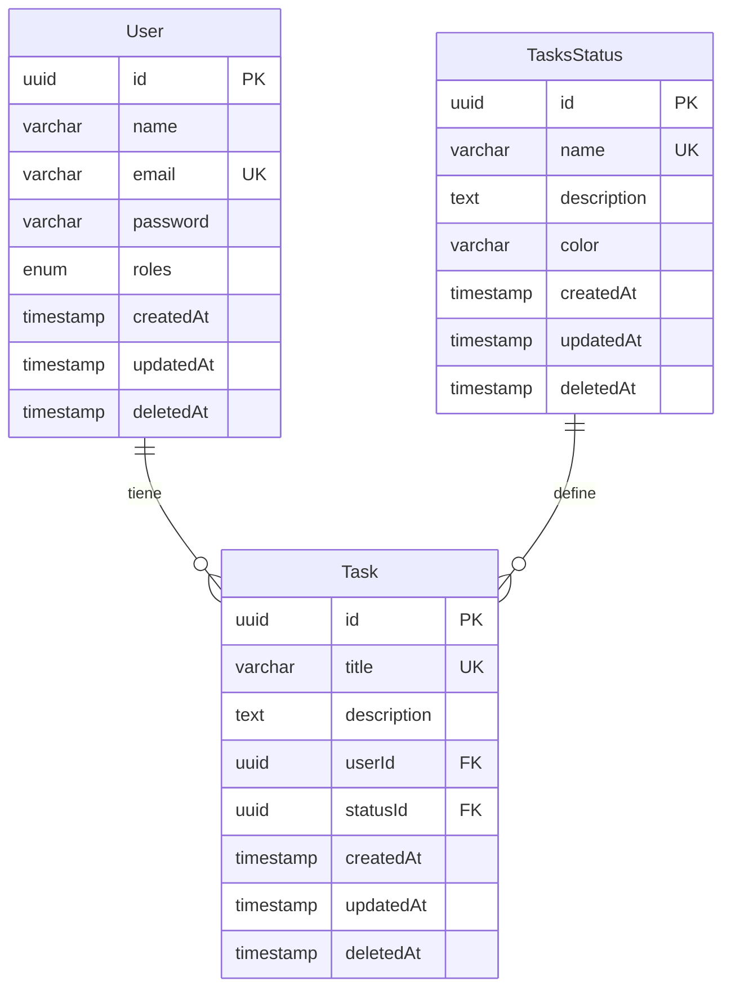

# 🚀 NestJS Angular Tasks - Backend API

Una API REST robusta y escalable construida con NestJS, TypeScript, TypeORM y PostgreSQL para la gestión de tareas con sistema de autenticación JWT y control de roles.


## 📋 Tabla de Contenidos

-   [Características](#-características)
-   [Arquitectura](#-arquitectura)
-   [Tecnologías](#-tecnologías)
-   [Prerrequisitos](#-prerrequisitos)
-   [Instalación](#-instalación)
-   [Configuración](#-configuración)
-   [Uso](#-uso)
-   [API Endpoints](#-api-endpoints)
-   [Estructura del Proyecto](#-estructura-del-proyecto)
-   [Base de Datos](#-base-de-datos)
-   [Autenticación y Autorización](#-autenticación-y-autorización)
-   [Validaciones](#-validaciones)
-   [Testing](#-testing)
-   [Deployment](#-deployment)
-   [Contribución](#-contribución)
-   [Licencia](#-licencia)

## ✨ Características

### 🔐 Sistema de Autenticación

-   **Registro de usuarios** con validación robusta
-   **Inicio de sesión** con JWT tokens
-   **Verificación de tokens** para rutas protegidas
-   **Roles de usuario** (admin/user) con permisos granulares
-   **Contraseñas seguras** con bcrypt y validación de complejidad

### 📋 Gestión de Tareas

-   **CRUD completo** de tareas (Crear, Leer, Actualizar, Eliminar)
-   **Estados personalizables** para las tareas
-   **Asignación de tareas** por usuario
-   **Filtrado por permisos** (usuarios ven solo sus tareas, admins ven todas)
-   **Soft delete** para eliminación segura

### 🛡️ Seguridad y Validación

-   **Validación automática** de DTOs con class-validator
-   **Sanitización de datos** con transformers
-   **Guards personalizados** para protección de rutas
-   **Manejo centralizado de errores**
-   **CORS configurado** para desarrollo

### 🗄️ Base de Datos

-   **PostgreSQL** como base de datos principal
-   **TypeORM** para ORM y migraciones
-   **Relaciones entre entidades** bien definidas
-   **Índices únicos** para optimización
-   **Timestamps automáticos** (createdAt, updatedAt, deletedAt)

## 🏗️ Arquitectura

La aplicación sigue una arquitectura modular basada en NestJS con separación clara de responsabilidades:

```
backend-tasks/
├── src/
│   ├── auth/           # Módulo de autenticación
│   ├── users/          # Módulo de usuarios
│   ├── tasks/          # Módulo de tareas
│   ├── tasks-statuses/ # Módulo de estados de tareas
│   ├── common/         # Módulo común (utils, guards, decorators)
│   ├── app.module.ts   # Módulo principal
│   └── main.ts         # Punto de entrada
└── public/             # Archivos estáticos
```

### Patrones Implementados

-   **Module Pattern**: Organización modular del código
-   **Repository Pattern**: Abstracción de acceso a datos con TypeORM
-   **Guard Pattern**: Protección de rutas con autenticación y autorización
-   **DTO Pattern**: Validación y transformación de datos
-   **Decorator Pattern**: Metadata para validaciones y permisos

## 🛠️ Tecnologías

### Core

-   **[NestJS](https://nestjs.com/)** `^10.0.0` - Framework Node.js progresivo
-   **[TypeScript](https://www.typescriptlang.org/)** `^5.1.3` - Lenguaje tipado
-   **[Node.js](https://nodejs.org/)** `>=18.0.0` - Runtime de JavaScript

### Base de Datos

-   **[PostgreSQL](https://www.postgresql.org/)** `>=14.0` - Base de datos relacional
-   **[TypeORM](https://typeorm.io/)** `^0.3.17` - ORM para TypeScript
-   **[pg](https://github.com/brianc/node-postgres)** `^8.11.3` - Driver PostgreSQL

### Autenticación y Seguridad

-   **[@nestjs/jwt](https://github.com/nestjs/jwt)** `^10.1.1` - JWT tokens
-   **[@nestjs/passport](https://github.com/nestjs/passport)** `^10.0.2` - Autenticación
-   **[passport-jwt](https://github.com/mikenicholson/passport-jwt)** `^4.0.1` - Estrategia JWT
-   **[bcryptjs](https://github.com/dcodeIO/bcrypt.js)** `^2.4.3` - Hash de contraseñas

### Validación y Transformación

-   **[class-validator](https://github.com/typestack/class-validator)** `^0.14.0` - Validación de DTOs
-   **[class-transformer](https://github.com/typestack/class-transformer)** `^0.5.1` - Transformación de objetos

### Utilidades

-   **[@nestjs/serve-static](https://github.com/nestjs/serve-static)** `^4.0.0` - Archivos estáticos
-   **[@nestjs/config](https://github.com/nestjs/config)** `^3.1.1` - Variables de entorno
-   **[uuid](https://github.com/uuidjs/uuid)** `^9.0.1` - Generación de UUIDs

## 📋 Prerrequisitos

Antes de comenzar, asegúrate de tener instalado:

-   **Node.js** >= 18.0.0
-   **npm** >= 9.0.0
-   **PostgreSQL** >= 14.0
-   **Git** (para clonación del repositorio)

### Verificación de Prerrequisitos

```bash
# Verificar versión de Node.js
node --version

# Verificar versión de npm
npm --version

# Verificar PostgreSQL
psql --version
```

## 🚀 Instalación

### 1. Clonar el Repositorio

```bash
git clone https://github.com/jebcdev/nestjs-angular-tasks.git
cd nestjs-angular-tasks/backend-tasks
```

### 2. Instalar Dependencias

```bash
# Instalar dependencias
npm install

# O usando yarn
yarn install
```

### 3. Configurar Base de Datos

Crear una base de datos PostgreSQL:

```sql
-- Conectar a PostgreSQL
psql -U postgres

-- Crear base de datos
CREATE DATABASE "nest-angular-tasks";

-- Crear usuario (opcional)
CREATE USER nest_user WITH PASSWORD 'nest_password';

-- Otorgar permisos
GRANT ALL PRIVILEGES ON DATABASE "nest-angular-tasks" TO nest_user;
```

## ⚙️ Configuración

### Variables de Entorno

Crear un archivo `.env` en la raíz del proyecto backend:

```env
# Configuración del Servidor
PORT=3000
API_PREFIX=api/v1

# Configuración de Base de Datos
DB_TYPE=postgres
DB_HOST=localhost
DB_PORT=5432
DB_USER=postgres
DB_PASSWORD=postgres
DB_NAME=nest-angular-tasks

# Configuración JWT
JWT_SECRET=tu_jwt_secret_super_seguro_aqui

# Configuración Bcrypt
BCRYPT_SALT=10

# Configuración de Entorno
NODE_ENV=development
```

### Configuración de Desarrollo

```bash
# Archivo .env.development
PORT=3001
NODE_ENV=development
DB_NAME=nest-angular-tasks-dev
```

### Configuración de Producción

```bash
# Archivo .env.production
PORT=3000
NODE_ENV=production
DB_NAME=nest-angular-tasks-prod
JWT_SECRET=tu_jwt_secret_production_muy_seguro
```

## 🎯 Uso

### Desarrollo

```bash
# Modo desarrollo (con hot reload)
npm run start:dev

# Modo desarrollo con debug
npm run start:debug
```

### Producción

```bash
# Compilar proyecto
npm run build

# Ejecutar en producción
npm run start:prod
```

### Otros Comandos Útiles

```bash
# Linting
npm run lint

# Formatear código
npm run format

# Testing
npm run test

# Testing con cobertura
npm run test:cov

# Testing e2e
npm run test:e2e
```

## 🌐 API Endpoints

### Base URL

```
http://localhost:3000/api/v1
```

### 🔐 Autenticación

| Método | Endpoint            | Descripción             | Autenticación |
| ------ | ------------------- | ----------------------- | ------------- |
| `POST` | `/auth/register`    | Registrar nuevo usuario | No            |
| `POST` | `/auth/login`       | Iniciar sesión          | No            |
| `POST` | `/auth/check-token` | Verificar token         | JWT           |

#### Registro de Usuario

```bash
POST /api/v1/auth/register
Content-Type: application/json

{
  "name": "Juan Pérez",
  "email": "juan@example.com",
  "password": "MiPassword123!",
  "roles": ["user"]
}
```

**Respuesta exitosa:**

```json
{
    "id": "uuid-here",
    "name": "Juan Pérez",
    "email": "juan@example.com",
    "roles": ["user"],
    "token": "jwt-token-here",
    "createdAt": "2025-01-28T10:00:00.000Z",
    "updatedAt": "2025-01-28T10:00:00.000Z"
}
```

#### Inicio de Sesión

```bash
POST /api/v1/auth/login
Content-Type: application/json

{
  "email": "juan@example.com",
  "password": "MiPassword123!"
}
```

### 📋 Tareas

| Método   | Endpoint     | Descripción               | Autenticación |
| -------- | ------------ | ------------------------- | ------------- |
| `GET`    | `/tasks`     | Listar tareas del usuario | JWT           |
| `GET`    | `/tasks/:id` | Obtener tarea específica  | JWT           |
| `POST`   | `/tasks`     | Crear nueva tarea         | JWT           |
| `PATCH`  | `/tasks/:id` | Actualizar tarea          | JWT           |
| `DELETE` | `/tasks/:id` | Eliminar tarea            | JWT           |

#### Crear Tarea

```bash
POST /api/v1/tasks
Authorization: Bearer jwt-token-here
Content-Type: application/json

{
  "title": "Completar documentación",
  "description": "Escribir README completo para el proyecto",
  "statusId": "uuid-del-estado"
}
```

#### Actualizar Tarea

```bash
PATCH /api/v1/tasks/uuid-de-la-tarea
Authorization: Bearer jwt-token-here
Content-Type: application/json

{
  "title": "Nuevo título",
  "description": "Nueva descripción",
  "statusId": "nuevo-uuid-del-estado"
}
```

### 🏷️ Estados de Tareas

| Método   | Endpoint              | Descripción               | Autenticación |
| -------- | --------------------- | ------------------------- | ------------- |
| `GET`    | `/tasks-statuses`     | Listar estados            | JWT           |
| `GET`    | `/tasks-statuses/:id` | Obtener estado específico | JWT           |
| `POST`   | `/tasks-statuses`     | Crear nuevo estado        | JWT + Admin   |
| `PATCH`  | `/tasks-statuses/:id` | Actualizar estado         | JWT + Admin   |
| `DELETE` | `/tasks-statuses/:id` | Eliminar estado           | JWT + Admin   |

#### Crear Estado de Tarea

```bash
POST /api/v1/tasks-statuses
Authorization: Bearer jwt-token-admin
Content-Type: application/json

{
  "name": "En Progreso",
  "description": "Tarea actualmente en desarrollo",
  "color": "#FFA500"
}
```

### 👥 Usuarios

| Método | Endpoint     | Descripción                | Autenticación |
| ------ | ------------ | -------------------------- | ------------- |
| `GET`  | `/users`     | Listar usuarios            | JWT + Admin   |
| `GET`  | `/users/:id` | Obtener usuario específico | JWT + Admin   |

## 📁 Estructura del Proyecto

```
backend-tasks/
├── src/
│   ├── auth/                           # 🔐 Módulo de Autenticación
│   │   ├── constants/
│   │   │   ├── index.ts
│   │   │   └── jwt.constants.ts        # Constantes JWT
│   │   ├── dto/
│   │   │   ├── auth-login.ts           # DTO para login
│   │   │   ├── auth-register.ts        # DTO para registro
│   │   │   └── index.ts
│   │   ├── interfaces/
│   │   │   ├── index.ts
│   │   │   └── jwt-payload.interface.ts # Interfaz payload JWT
│   │   ├── strategies/
│   │   │   ├── index.ts
│   │   │   └── jwt-strategy.ts         # Estrategia JWT Passport
│   │   ├── auth.controller.ts          # Controlador de autenticación
│   │   ├── auth.module.ts              # Módulo de autenticación
│   │   └── auth.service.ts             # Servicio de autenticación
│   │
│   ├── common/                         # 🛠️ Módulo Común
│   │   ├── decorators/
│   │   │   ├── index.ts
│   │   │   └── roles.ts                # Decorador de roles
│   │   ├── enums/
│   │   │   ├── index.ts
│   │   │   └── roles.ts                # Enum de roles
│   │   ├── guards/
│   │   │   ├── admin.ts                # Guard de administrador
│   │   │   ├── index.ts
│   │   │   └── roles.ts                # Guard de roles
│   │   ├── utils/
│   │   │   ├── bcrypt.ts               # Utilidades bcrypt
│   │   │   ├── handle-errors.ts        # Manejo de errores
│   │   │   └── index.ts
│   │   ├── common.module.ts            # Módulo común
│   │   └── common.service.ts           # Servicio común
│   │
│   ├── tasks/                          # 📋 Módulo de Tareas
│   │   ├── dto/
│   │   │   ├── create-task.dto.ts      # DTO crear tarea
│   │   │   ├── index.ts
│   │   │   └── update-task.dto.ts      # DTO actualizar tarea
│   │   ├── entities/
│   │   │   └── task.entity.ts          # Entidad de tarea
│   │   ├── tasks.controller.ts         # Controlador de tareas
│   │   ├── tasks.module.ts             # Módulo de tareas
│   │   └── tasks.service.ts            # Servicio de tareas
│   │
│   ├── tasks-statuses/                 # 🏷️ Módulo Estados de Tareas
│   │   ├── dto/
│   │   │   ├── create-tasks-status.dto.ts
│   │   │   ├── index.ts
│   │   │   └── update-tasks-status.dto.ts
│   │   ├── entities/
│   │   │   └── tasks-status.entity.ts  # Entidad estado de tarea
│   │   ├── tasks-statuses.controller.ts
│   │   ├── tasks-statuses.module.ts
│   │   └── tasks-statuses.service.ts
│   │
│   ├── users/                          # 👥 Módulo de Usuarios
│   │   ├── dto/
│   │   │   ├── create-user.dto.ts      # DTO crear usuario
│   │   │   └── update-user.dto.ts      # DTO actualizar usuario
│   │   ├── entities/
│   │   │   └── user.entity.ts          # Entidad de usuario
│   │   ├── users.controller.ts         # Controlador de usuarios
│   │   ├── users.module.ts             # Módulo de usuarios
│   │   └── users.service.ts            # Servicio de usuarios
│   │
│   ├── app.module.ts                   # 🏠 Módulo principal
│   └── main.ts                         # 🚀 Punto de entrada
│
├── public/                             # 📁 Archivos estáticos
│   └── index.html                      # Página de bienvenida
│
├── .env                                # 🔧 Variables de entorno
├── .gitignore                          # 📝 Archivos ignorados por Git
├── nest-cli.json                       # ⚙️ Configuración NestJS CLI
├── package.json                        # 📦 Dependencias del proyecto
├── README.md                           # 📖 Este archivo
├── tsconfig.build.json                 # 🔨 Config TypeScript build
└── tsconfig.json                       # 🔨 Config TypeScript
```

## 🗄️ Base de Datos

### Modelo de Datos



### Entidades

#### User (Usuarios)

```typescript
{
  id: string;           // UUID - Clave primaria
  name: string;         // Nombre del usuario (2-100 caracteres)
  email: string;        // Email único (formato válido)
  password: string;     // Contraseña hasheada (bcrypt)
  roles: Roles[];       // Array de roles [admin, user]
  token?: string;       // Token JWT (virtual)
  tasks: Task[];        // Relación con tareas
  createdAt: Date;      // Fecha de creación
  updatedAt: Date;      // Fecha de actualización
  deletedAt?: Date;     // Fecha de eliminación (soft delete)
}
```

#### Task (Tareas)

```typescript
{
  id: string;           // UUID - Clave primaria
  title: string;        // Título único por usuario (2-200 caracteres)
  description: string;  // Descripción opcional (max 1000 caracteres)
  user: User;           // Relación con usuario propietario
  status: TasksStatus;  // Relación con estado de tarea
  createdAt: Date;      // Fecha de creación
  updatedAt: Date;      // Fecha de actualización
  deletedAt?: Date;     // Fecha de eliminación (soft delete)
}
```

#### TasksStatus (Estados de Tareas)

```typescript
{
  id: string;           // UUID - Clave primaria
  name: string;         // Nombre único del estado (2-100 caracteres)
  description?: string; // Descripción opcional
  color: string;        // Color hexadecimal (#FFFFFF)
  tasks: Task[];        // Relación con tareas
  createdAt: Date;      // Fecha de creación
  updatedAt: Date;      // Fecha de actualización
  deletedAt?: Date;     // Fecha de eliminación (soft delete)
}
```

### Configuración TypeORM

```typescript
TypeOrmModule.forRoot({
    type: "postgres",
    host: process.env.DB_HOST || "localhost",
    port: parseInt(process.env.DB_PORT) || 5432,
    username: process.env.DB_USER || "postgres",
    password: process.env.DB_PASSWORD || "postgres",
    database: process.env.DB_NAME || "nest-angular-tasks",
    autoLoadEntities: true, // Carga automática de entidades
    synchronize: true, // Solo para desarrollo
    logging: true, // Log de consultas SQL
});
```

## 🔐 Autenticación y Autorización

### JWT Strategy

La aplicación utiliza JWT (JSON Web Tokens) para autenticación:

```typescript
// Payload del token
interface IJwtPayload {
  data: string; // ID del usuario
}

// Configuración JWT
{
  secret: JWT_SECRET,
  signOptions: { expiresIn: '1d' } // Token válido por 1 día
}
```

### Sistema de Roles

```typescript
enum Roles {
    admin = "admin", // Acceso completo al sistema
    user = "user", // Acceso limitado a sus propios recursos
}
```

### Guards Implementados

#### AuthGuard (JWT)

-   Protege rutas que requieren autenticación
-   Valida token JWT en header Authorization
-   Inyecta usuario en `req.user`

#### RolesGuard

-   Verifica roles específicos requeridos
-   Se usa con el decorador `@RequireRoles()`
-   Permite acceso granular por rol

#### AdminGuard

-   Simplificación para rutas que requieren rol admin
-   Extiende RolesGuard con rol admin predefinido

### Uso de Guards

```typescript
// Proteger con autenticación JWT
@UseGuards(AuthGuard('jwt'))
@Controller('tasks')
export class TasksController {}

// Proteger con rol específico
@Post()
@UseGuards(AuthGuard('jwt'), AdminGuard)
@RequireRoles(Roles.admin)
createTaskStatus() {}
```

## ✅ Validaciones

### DTOs con Class-Validator

Todas las entradas de datos son validadas usando class-validator:

#### Validaciones de Usuario

```typescript
export class AuthRegisterDto {
    @IsString()
    @IsNotEmpty()
    @MinLength(2)
    @MaxLength(100)
    @Transform(({ value }) => value?.trim())
    name: string;

    @IsEmail()
    @IsNotEmpty()
    @MaxLength(150)
    @Transform(({ value }) => value?.trim().toLowerCase())
    email: string;

    @IsString()
    @MinLength(8)
    @MaxLength(50)
    @Matches(
        /(?:(?=.*\d)|(?=.*\W+))(?![.\n])(?=.*[A-Z])(?=.*[a-z]).*$/
    )
    password: string;

    @IsOptional()
    @IsArray()
    @IsEnum(Roles, { each: true })
    roles?: Roles[];
}
```

#### Validaciones de Tarea

```typescript
export class CreateTaskDto {
    @IsString()
    @IsNotEmpty()
    @MinLength(2)
    @MaxLength(200)
    @Transform(({ value }) => value?.trim())
    title: string;

    @IsOptional()
    @IsString()
    @MaxLength(1000)
    @Transform(({ value }) => value?.trim())
    description?: string;

    @IsString()
    @IsNotEmpty()
    @IsUUID("4")
    statusId: string;
}
```

### Configuración Global de Validación

```typescript
app.useGlobalPipes(
    new ValidationPipe({
        whitelist: true, // Solo propiedades permitidas
        forbidNonWhitelisted: true, // Rechaza propiedades extra
        transform: true, // Transforma automáticamente
        transformOptions: {
            enableImplicitConversion: true, // Conversión de tipos
        },
    })
);
```

## 🧪 Testing

### Estructura de Tests

```
src/
├── auth/
│   ├── auth.controller.spec.ts
│   ├── auth.service.spec.ts
│   └── jwt-strategy.spec.ts
├── tasks/
│   ├── tasks.controller.spec.ts
│   └── tasks.service.spec.ts
└── ...
```

### Comandos de Testing

```bash
# Unit tests
npm run test

# Unit tests con watch mode
npm run test:watch

# Tests específicos
npm run test -- auth.service.spec.ts

# Cobertura de código
npm run test:cov

# Tests end-to-end
npm run test:e2e

# Tests e2e con watch mode
npm run test:e2e:watch
```

### Ejemplo de Test

```typescript
describe("AuthService", () => {
    let service: AuthService;
    let userRepository: Repository<User>;

    beforeEach(async () => {
        const module: TestingModule = await Test.createTestingModule({
            providers: [
                AuthService,
                {
                    provide: getRepositoryToken(User),
                    useClass: Repository,
                },
                {
                    provide: JwtService,
                    useValue: {
                        sign: jest.fn(() => "test-token"),
                    },
                },
            ],
        }).compile();

        service = module.get<AuthService>(AuthService);
        userRepository = module.get<Repository<User>>(
            getRepositoryToken(User)
        );
    });

    it("should be defined", () => {
        expect(service).toBeDefined();
    });

    describe("registerUser", () => {
        it("should register a new user successfully", async () => {
            // Test implementation
        });
    });
});
```

## 🚀 Deployment

### Docker

#### Dockerfile

```dockerfile
FROM node:18-alpine

WORKDIR /app

COPY package*.json ./
RUN npm ci --only=production

COPY . .
RUN npm run build

EXPOSE 3000

CMD ["npm", "run", "start:prod"]
```

#### docker-compose.yml

```yaml
version: "3.8"

services:
    app:
        build: .
        ports:
            - "3000:3000"
        depends_on:
            - postgres
        environment:
            - DB_HOST=postgres
            - DB_PORT=5432
            - DB_USER=postgres
            - DB_PASSWORD=postgres
            - DB_NAME=nest-angular-tasks
            - JWT_SECRET=your-super-secure-jwt-secret

    postgres:
        image: postgres:15-alpine
        ports:
            - "5432:5432"
        environment:
            - POSTGRES_USER=postgres
            - POSTGRES_PASSWORD=postgres
            - POSTGRES_DB=nest-angular-tasks
        volumes:
            - postgres_data:/var/lib/postgresql/data

volumes:
    postgres_data:
```

### Comandos Docker

```bash
# Construir imagen
docker build -t nestjs-tasks-api .

# Ejecutar con docker-compose
docker-compose up -d

# Ver logs
docker-compose logs -f app

# Parar servicios
docker-compose down
```

### Variables de Entorno Producción

```env
NODE_ENV=production
PORT=3000
API_PREFIX=api/v1

# Base de datos segura
DB_HOST=your-production-host
DB_PORT=5432
DB_USER=your-production-user
DB_PASSWORD=your-super-secure-password
DB_NAME=nest-angular-tasks-prod

# JWT secreto fuerte
JWT_SECRET=your-production-jwt-secret-very-secure-and-long

# Bcrypt con salt alto
BCRYPT_SALT=12
```

### Checklist de Deployment

-   [ ] Variables de entorno configuradas
-   [ ] Base de datos de producción creada
-   [ ] JWT_SECRET seguro generado
-   [ ] CORS configurado para dominio de producción
-   [ ] HTTPS habilitado
-   [ ] Logs configurados
-   [ ] Monitoreo implementado
-   [ ] Backup de base de datos programado

## 🤝 Contribución

### Flujo de Contribución

1. **Fork** el repositorio
2. **Clone** tu fork localmente
3. **Crea** una branch para tu feature: `git checkout -b feature/nueva-funcionalidad`
4. **Desarrolla** tu feature con tests
5. **Commit** tus cambios: `git commit -m "feat: añadir nueva funcionalidad"`
6. **Push** a tu branch: `git push origin feature/nueva-funcionalidad`
7. **Abre** un Pull Request

### Estándares de Código

#### Commits Convencionales

```bash
feat: añadir nueva funcionalidad
fix: corregir bug específico
docs: actualizar documentación
style: cambios de formato de código
refactor: refactorizar código existente
test: añadir o modificar tests
chore: tareas de mantenimiento
```

#### Linting y Formato

```bash
# Verificar linting
npm run lint

# Arreglar problemas de linting
npm run lint:fix

# Formatear código
npm run format
```

#### Tests Requeridos

-   Unit tests para servicios
-   Integration tests para controladores
-   E2E tests para flujos críticos
-   Cobertura mínima del 80%

### Estructura de Pull Request

```markdown
## Descripción

Breve descripción de los cambios realizados.

## Tipo de Cambio

-   [ ] Bug fix
-   [ ] Nueva funcionalidad
-   [ ] Breaking change
-   [ ] Documentación

## Testing

-   [ ] Tests unitarios añadidos/actualizados
-   [ ] Tests de integración añadidos/actualizados
-   [ ] Tests E2E añadidos/actualizados

## Checklist

-   [ ] Mi código sigue los estándares del proyecto
-   [ ] He realizado una auto-revisión de mi código
-   [ ] He comentado mi código, especialmente en partes complejas
-   [ ] He actualizado la documentación correspondiente
-   [ ] Mis cambios no generan warnings
-   [ ] He añadido tests que prueban mi fix/funcionalidad
-   [ ] Tests nuevos y existentes pasan localmente
```

## 📝 Licencia

Este proyecto está bajo la licencia MIT. Ver el archivo [LICENSE](LICENSE) para más detalles.

```
MIT License

Copyright (c) 2025 jebcdev

Permission is hereby granted, free of charge, to any person obtaining a copy
of this software and associated documentation files (the "Software"), to deal
in the Software without restriction, including without limitation the rights
to use, copy, modify, merge, publish, distribute, sublicense, and/or sell
copies of the Software, and to permit persons to whom the Software is
furnished to do so, subject to the following conditions:

The above copyright notice and this permission notice shall be included in all
copies or substantial portions of the Software.

THE SOFTWARE IS PROVIDED "AS IS", WITHOUT WARRANTY OF ANY KIND, EXPRESS OR
IMPLIED, INCLUDING BUT NOT LIMITED TO THE WARRANTIES OF MERCHANTABILITY,
FITNESS FOR A PARTICULAR PURPOSE AND NONINFRINGEMENT. IN NO EVENT SHALL THE
AUTHORS OR COPYRIGHT HOLDERS BE LIABLE FOR ANY CLAIM, DAMAGES OR OTHER
LIABILITY, WHETHER IN AN ACTION OF CONTRACT, TORT OR OTHERWISE, ARISING FROM,
OUT OF OR IN CONNECTION WITH THE SOFTWARE OR THE USE OR OTHER DEALINGS IN THE
SOFTWARE.
```

---

## 📞 Contacto y Soporte

### Autor

-   **GitHub**: [@jebcdev](https://github.com/jebcdev)
-   **Email**: [contacto@jebcdev.com](mailto:contacto@jebcdev.com)

### Reportar Issues

Si encuentras algún bug o tienes una sugerencia, por favor:

1. Revisa los [issues existentes](https://github.com/jebcdev/nestjs-angular-tasks/issues)
2. Si no existe, [crea un nuevo issue](https://github.com/jebcdev/nestjs-angular-tasks/issues/new)
3. Proporciona la mayor información posible:
    - Descripción del problema
    - Pasos para reproducir
    - Comportamiento esperado vs actual
    - Screenshots si aplica
    - Información del entorno (Node.js, OS, etc.)

### Roadmap

-   [ ] **v1.1.0**: Implementación de notificaciones en tiempo real
-   [ ] **v1.2.0**: Sistema de comentarios en tareas
-   [ ] **v1.3.0**: Dashboard de métricas y reportes
-   [ ] **v1.4.0**: API de integración con terceros
-   [ ] **v2.0.0**: Migración a microservicios

---

## 🙏 Agradecimientos

Agradecimientos especiales a:

-   **[NestJS Team](https://nestjs.com/)** - Por el increíble framework
-   **[TypeORM Team](https://typeorm.io/)** - Por el excelente ORM
-   **Comunidad Open Source** - Por las librerías y herramientas utilizadas

---

<div align="center">

**⭐ Si este proyecto te ha sido útil, no olvides darle una estrella en GitHub ⭐**

[](https://github.com/jebcdev/nestjs-angular-tasks/stargazers)
[](https://github.com/jebcdev/nestjs-angular-tasks/network/members)

Made with ❤️ by [jebcdev](https://github.com/jebcdev)

</div>
